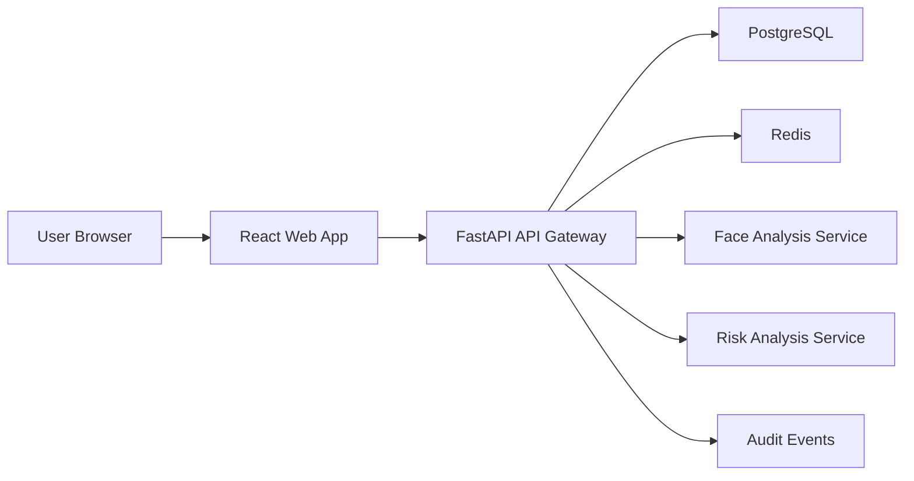
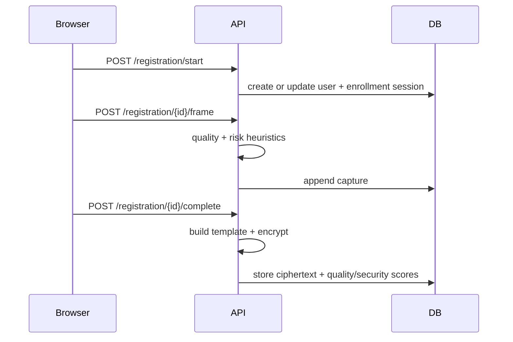
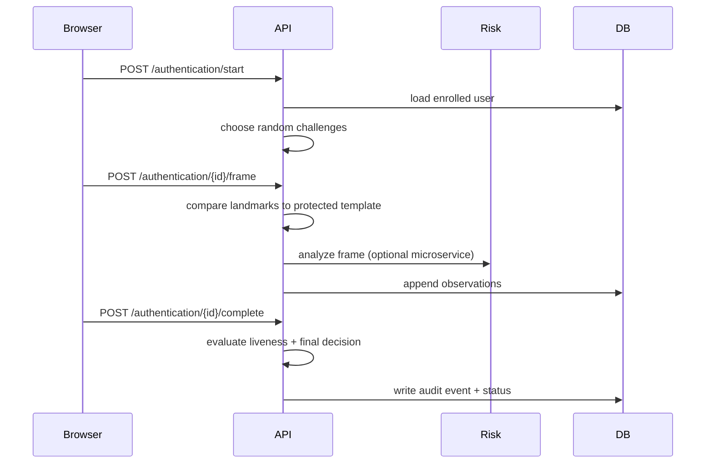

# Architecture

## System Overview

DeepShield Guardian is organized as a layered service architecture:

## Layer Responsibilities

### Presentation Layer

- Handles webcam permissions and MediaPipe landmark extraction
- Guides the user through registration and authentication
- Displays quality hints, stage states, and challenge prompts

### API Gateway and Business Logic

- Owns registration and authentication session lifecycles
- Encrypts and stores biometric templates
- Selects randomized challenge sequences
- Evaluates passive PAD, geometric matching, liveness, and decision policy
- Records auditable events for security review

### Data Layer

- PostgreSQL stores users, enrollment sessions, auth attempts, and audit events
- Redis is reserved for short-lived tokens, rate limits, and challenge caches

### ML Service Layer

- `ml-face` exposes landmark embedding extraction
- `ml-risk` exposes heuristic PAD/deepfake scoring
- The API currently runs safe in-process fallbacks so local development still works if microservices are unavailable

## AI Documentation

- `docs/ai-models.md` explains the implemented recognition, PAD, deepfake, liveness, temporal, and decision pipeline
- `docs/ai-model-catalog.md` maps recommended future model families, datasets, evaluation plans, and deployment concerns
- `docs/ai-model-appendix.md` provides the detailed challenge reference, metric glossary, and review templates for the AI stack

## Registration Flow

## Authentication Flow

## Decision Policy

All major stages must individually pass:

- Face detection
- Passive PAD
- Recognition
- Feature verification
- Liveness
- Deepfake scan

Aggregate score weights:

- PAD: `0.20`
- Recognition: `0.25`
- Feature verification: `0.15`
- Liveness: `0.25`
- Deepfake scan: `0.15`

The default policy denies access unless all stage thresholds pass and the weighted aggregate reaches `0.88`.

## Extension Points

- Replace deterministic landmark embeddings with ArcFace or FaceNet
- Replace heuristic risk scoring with ONNX-served PAD and deepfake classifiers
- Add Redis-backed rate limiting and nonce-bound streaming sessions
- Add S3-compatible encrypted object storage for reference frame retention

